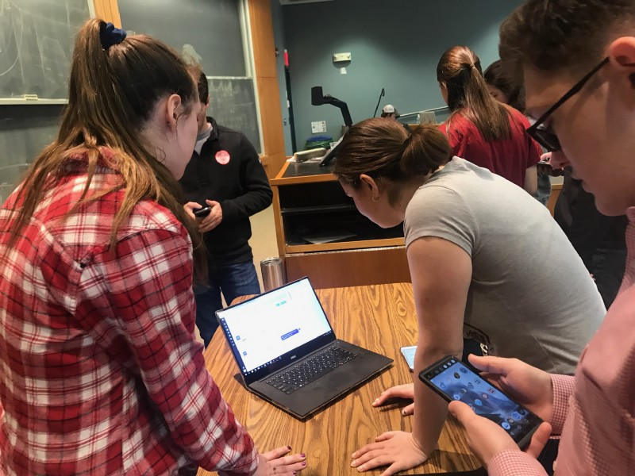

## Summary
In the final design sprint of this course, I created this website portfolio that breaks down and reflects on all the projects I completed this term in my Human Computer Interaction class at WPI. The overarching message I took from the class is that the documentation of a procedure you took to achieve your project goal is just as important as the end product. Throughout the course, we read a lot of articles on creating good design documents and implementing various design principles to help us create a focus point and eventually develop a meaningful end product as part of our solution. I learned that a variety of projects require different approaches to the design process. However, I found that the following five points form the core of defining a design process for these HCI projects:

-5 sheet design principles

-Exploring options and solutions

-Prototyping

-User testing

-Looking back and expanding on ideas

*********

## 5 Sheet Design Principles
For this design ideation step, I mainly used the [5 Design Sheet website](http://fds.design/) to set up brainstorming, initial design, and a final design sheets to set up an initial discussion of our group’s ideas with one another. It additionally helped us gather and organize our thoughts on paper in the early stages of the project to see if our ideas were worth implementing. For example, we were able to outline a focus point, details, operations, and weigh the pros and cons for each idea. More importantly, by executing this step, we could establish the answer to the question of "What is the purpose for the user?" It is significant to determine the objective or overall goal of the project because in the end, we want to deliver a product beyond the expectations of the user and leave a long-lasting impact on them. 

In our [Design for Understanding](https://medium.com/design-for-understanding) project, we used this design approach to highlight the different types of graphs we could use to demonstrate our clear communication aspect, a series of graphs that aim to make a point in a straightforward manner as well as how to form our persuasion visual, which should tell a compelling story to the user. All of our team members had many different ideas ranging from the data points we could communicate to the user to the compatible graphs or pictures to showcase that data set. By defining the advantages/disadvantages, specific details, and operations for each idea, we were able to determine the best purpose that will leave a lasting impression on the user and narrow down the exact graphs and persuasion visuals to use towards the beginning of the project itself. We were then able to focus more on how to implement our ideas and this process became easier since we already knew exactly what we wanted to demonstrate with the final design sheet we created. 

An example of our brainstorming and final design sheets. 

## Exploring Options and Solutions
Since a lot of our projects were open-ended especially towards the end of the term, we had to start exploring our options based on technical limitations and the given time. One of the biggest challenges of these projects was to come up with a realistic timeline and goal. We wanted to be very ambitious in our projects and achieve the most we could, but we also had to realize that we wouldn't always be able to get our expectations to meet reality. However, we knew we could certainly try to familiarize ourselves with the technology at hand as much as possible to implement some interesting features. 

For example, we encountered some technical trade-offs in [Design for Wellbeing](https://medium.com/design-for-wellbeing/design-for-wellbeing-creating-an-emotion-detector-to-control-videos-41709636be07), in which we developed a YouTube Emotion Detector using Affectiva, since it was the most technically challenging project of the term. At first, we wanted to add songs to a playlist if the user reacted happily in the webcam while it was playing. Our team members were also not well acquainted with the technology needed for this project such as JavaScript. So, we immediately started looking into Spotify and YouTube APIs and found this idea would not be practical in the time and skills we had. Instead, we narrowed down our goal to include four emotions: happy, sad, neutral, and screaming that would affect the video playing by altering volume for example since there were built in functions in the YouTube API to use. We still got good feedback about our idea and made a meaningful impact to help users discover their favorite videos. Thus, it is important to explore different options and solutions to gather knowledge about certain limitations and work with what you have to still deliver an impactful project. 

The final product of our Design for Wellbeing project. 

## Prototyping
As explained by Andy Ko on [this site](http://faculty.washington.edu/ajko/books/design-methods/how-to-prototype.html), prototyping is used to address concerns about whether a product will work or if it even acknowledges the problem at hand. It was helpful for us to figure out areas to improve the design and eventually develop a product that satisfies the situation without wasting time and taking up valuable resources building the actual model when we are not sure if it will even work. There are many different types of prototyping techniques such as paper prototypes and Wizard of Oz testing. 

In our [Design for Others](https://medium.com/design-for-others/design-for-others-redesigning-the-worcester-public-library-site-95cec1781f9f) project, we rebuilt the Worcester Public Library site for mobile phones for our demographic group consisting of women aged 30-40 years old. We prototyped using Adobe XD to build our mock-up site and put it on invision.com to link to each picture and make it look like a realistic webpage. In this way, we were able to waste less time instead of building an actual website and quickly see places to improve. For example, we were able to see that on mobile phones and for our specific demographic, there should be less words and scrolling for easy usability. So, we proceeded to break the large amounts of text into smaller chunks to make it more readable.   

## User Testing
Having the actual users test a product is key to having a successful design. We found that it is helpful for testers, who have been working on the same idea for a long time, to have fresh set of eyes, the users, look into the product. This way, there will be an opportunity for anything that the testers may not have thought about or addressed before to come up. Again, the users are the people who will be using the product so taking into account their suggestions can help us, as the testers or developers, expand our project on a whole other level to achieve our goals and reach a larger audience. 

In the [Design for Tension](https://medium.com/design-for-tension/design-for-tension-designing-a-chat-box-for-friends-of-depressed-people-4275612161d) project, which is based on a chatbot designed to help people concerned for their depressed friends, user testing was a central part to the design process. For instance, we first designed a flow chart to map the conversational paths that we wanted our chatbot to take. After this, we sat down with a group of users and we, the team members, acted as the chatbot and asked them questions based on the paths we brainstormed. After our rounds of questions, the users felt they were not clear about what to say when the bot introduced itself. They did like the yes or no format and wanted it to be more consistent to induce a more natural feel. Without this user testing, we would have not been able to make the necessary improvements, which helped us address our overall problem better than before. 

Formative User Testing with students in our HCI class. 

## Looking Back
I like to use this looking back section as a major way to reflect back on all my HCI projects. It is important to look back and see areas where things have gone well and places where the designs can be improved. In addition, it is interesting to see where I can expand on a project if I were given more resources or time. After all, each project is a new learning experience for me and I was always able to learn at least one new concept after completing an assignment. This reflection section helps me improve my design process after every assignment. 

*********

## Conclusion
Before taking this class, I was unfamiliar with the whole design process. However, as the term came to a close, I learned a lot about design techniques and believe I can implement the knowledge I earned through project iterations and demonstration days on future projects as well. I also realized that using the design process to document my journey to develop a final solution for my projects is a valuable skill I developed in the duration of the course. Furthermore, I discovered that I am passionate about design/web development and anticipate opting for that path in my computer science career. Overall, it has been a great term as I gained a lot of learning experiences from the variety of interesting projects and I can't wait to apply these skills to more projects at both WPI and my career!
