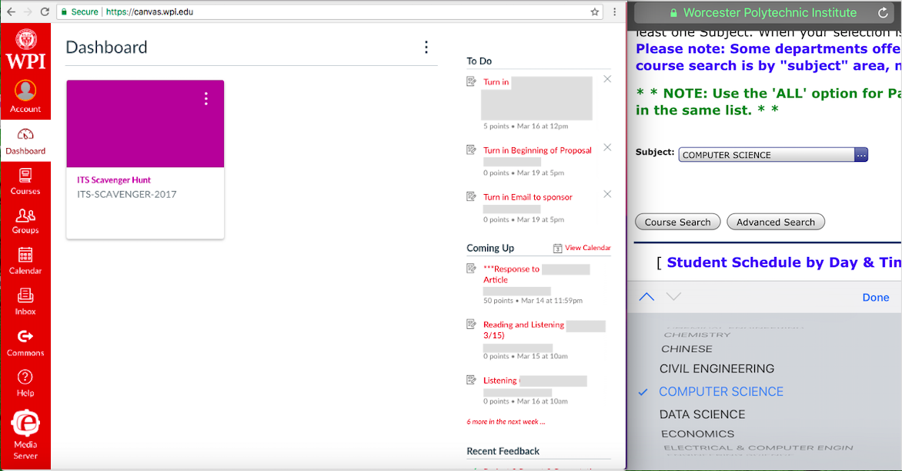
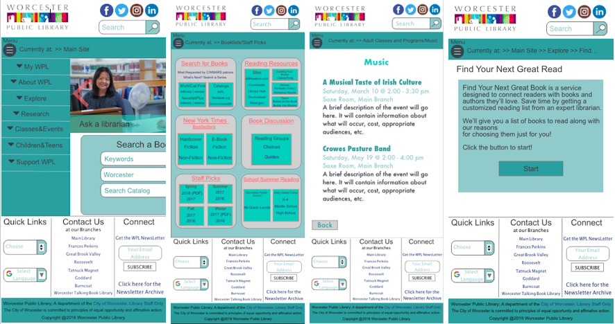
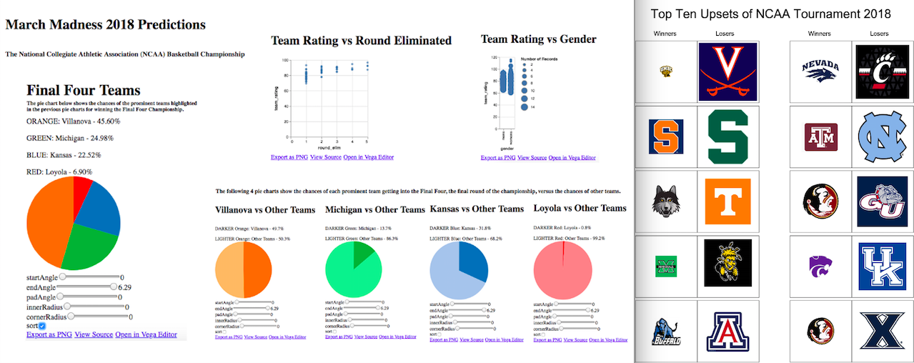

### Good Design, Bad Design

WPI has many well-designed websites such as **Canvas** (on the left), a site for students and faculty to primarily manage their courses. However, there are also a few poorly-designed websites such as **Bannerweb** (on the right), used by the WPI community to register or pay for classes among many other features. 

Read more on my blogpost on Medium: [Good Design, Bad Design](https://medium.com/@vandana1anand/bad-design-732129827e4c). 

### Design for Others

My team and I redesigned the Worcester Public Library Website for an iPhone based on the demographics group we were given in class, **women aged 30 to 40 years old**. Our goal was to increase user readabiliy and navigability. This was the first project in which we implemented the design process: ideate, prototype, and test. We built the final product using a site called invision that allowed us to link webpages together to create a realistic prototype.  

Read more on my blogpost on Medium: [Design for Others](https://medium.com/design-for-others/design-for-others-redesigning-the-worcester-public-library-site-95cec1781f9f).

### Design for Understanding

Our project focuses on communicating the same data set, we choose March Madness 2018 Predictions, using data visualization techniques in two different ways: **clear communication and persuasion**. Clear communication visuals (on the left) are a series of graphs and charts that give a straightforward approach to the data while persuasion visuals (on the right) share a story to leave a long lasting impact on the user. 

Read more on my blogpost on Medium: [Design for Understanding](https://medium.com/design-for-understanding/design-for-understanding-clear-communication-versus-persuasion-e634f93a998e).

### Design for Tension

<iframe width="560" height="315" src="https://www.youtube.com/embed/zDlTJC17kok" frameborder="0" allow="autoplay; encrypted-media" allowfullscreen></iframe>
In this project, my team and I created a chatbot that attempts to tackle a tense topic. We chose to focus on **teenagers who are concered for their friends struggling with depression**. Many times teenagers want to help their dear friends dealing with this tough situation, but they are not sure what to do. The bot serves to spread awareness about depression and help inform them about how to react in certain situations. 

Read more on my blogpost on Medium: [Design for Tension](https://medium.com/design-for-tension/design-for-tension-designing-a-chat-box-for-friends-of-depressed-people-4275612161d).

### Design for Wellbeing

Currently in process.
